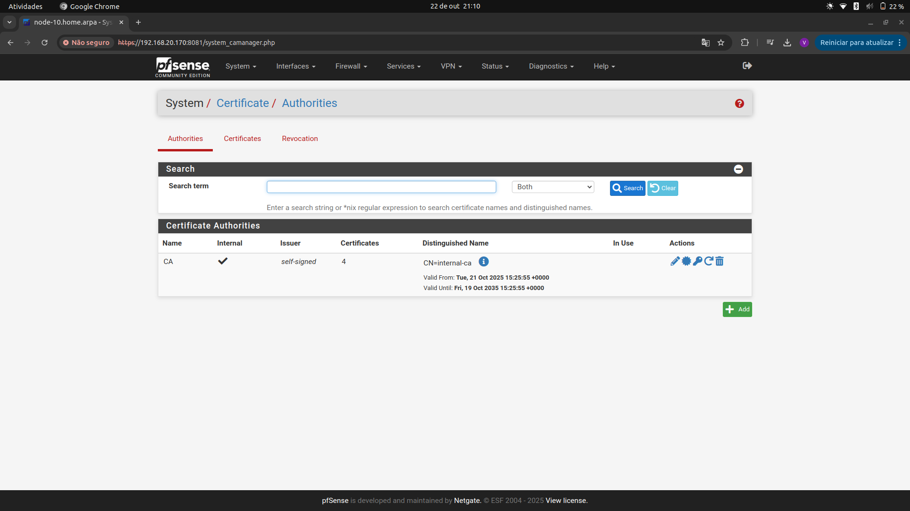
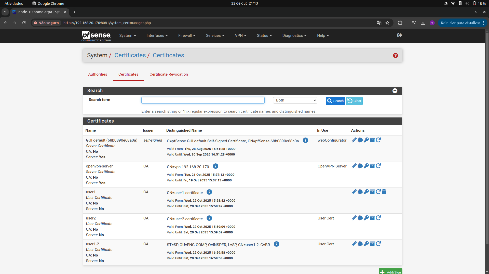
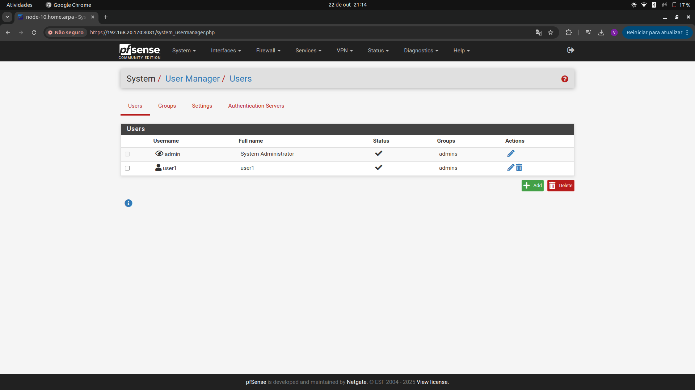
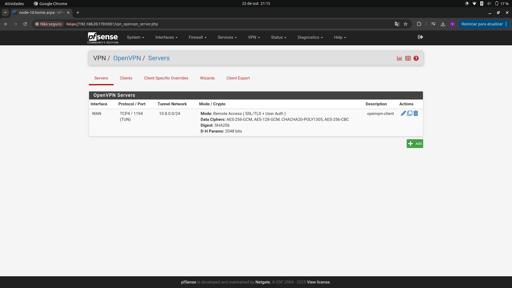
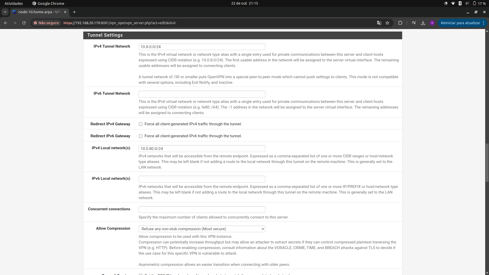
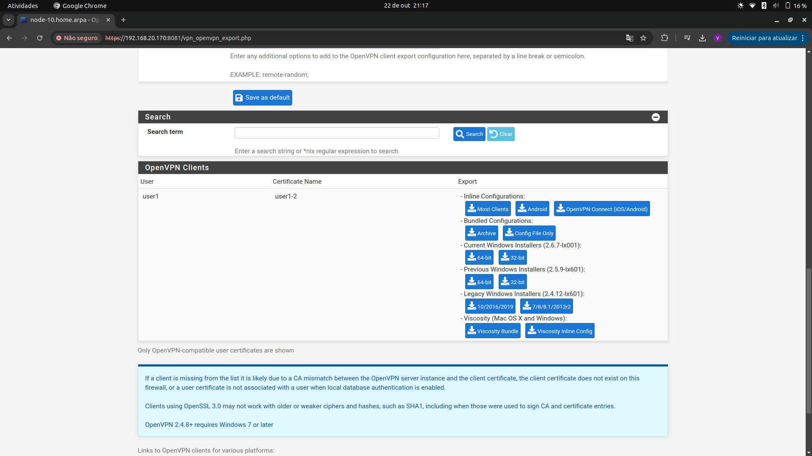
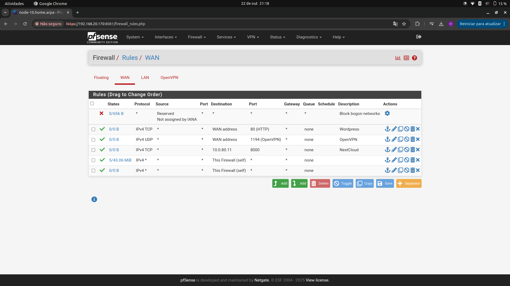
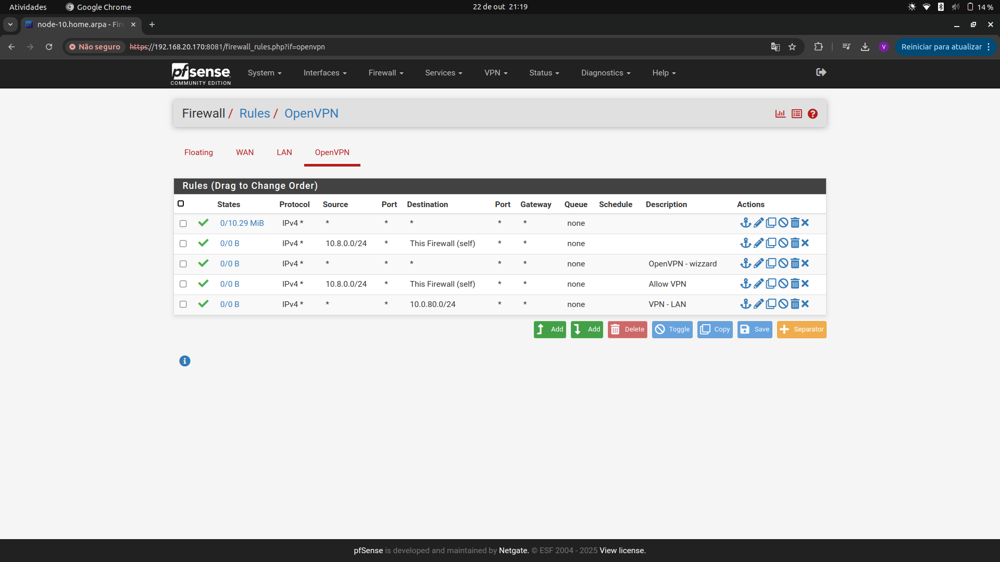
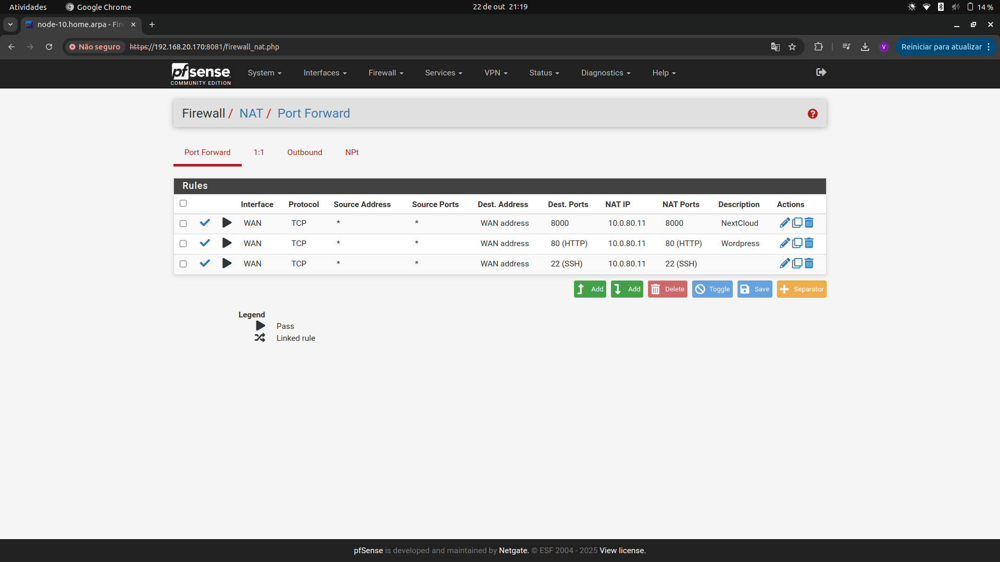
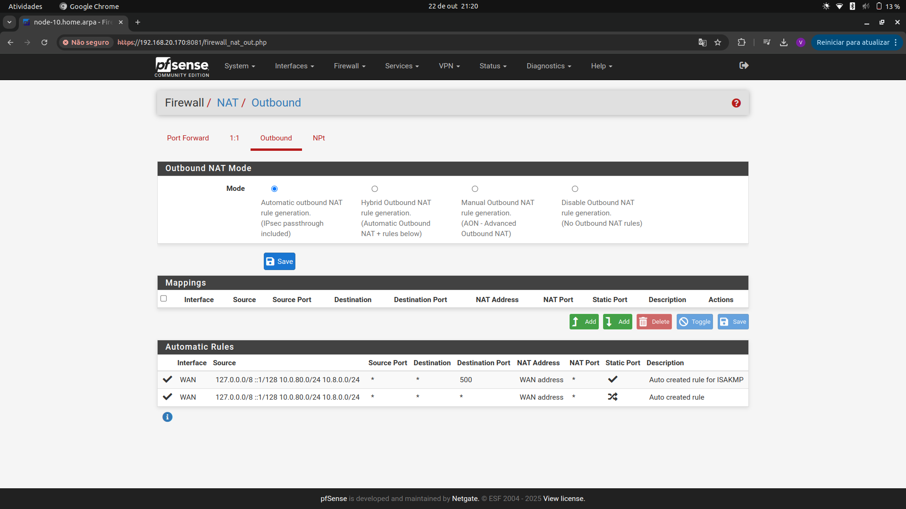

# Relatório Técnico — pfSense, OpenVPN, WordPress e Nextcloud

**Matéria:** Tecnologias Hacker  
**Data:** 22/10/2025  
**Alunos:** Fernando Koelle e Vitor Padovani

Ambiente auto-hospedado usando **pfSense** como firewall/roteador, publicando **WordPress** e **Nextcloud** e oferecendo acesso remoto seguro via **OpenVPN (tun)**. Apenas portas necessárias são expostas em **NAT Port Forward**; o restante é bloqueado por **regras de firewall**. A administração de servidores é feita por **SSH** restrito. A arquitetura inclui **WAN**, **LAN** e rede de túnel (**VPN**).

---

## 1. Topologia de Rede

```
flowchart LR
    INET((Internet / Upstream))
    PFS[pfSense\nWAN: 192.168.20.170\nLAN: 10.0.80.1]
    NUC[Servidor NUC\n10.0.80.11\nApache/PHP + MariaDB\nWordPress:80\nNextcloud:8000]
    OVPN[OpenVPN (tun)\nRede: 10.8.0.0/24\nServidor: 10.8.0.1\nClientes: 10.8.0.x]

    INET -->|Tráfego externo| PFS
    PFS --- OVPN
    PFS -->|LAN| NUC

    %% Port Forwards (WAN -> LAN)
    INET -.->|NAT 80/TCP| PFS -.-> NUC
    INET -.->|NAT 8000/TCP| PFS -.-> NUC
```

**Observação:** a WAN do pfSense está em `192.168.20.170/24` (RFC1918). Para acesso pela Internet, é necessário port forward também no **roteador upstream** (duplo NAT), apontando `80/8000/1194` para `192.168.20.170`.

---

## 2. Endereçamento IP

| Componente                          | Interface/Serviço | IP / Rede          | Observações                                   |
|------------------------------------|-------------------|--------------------|-----------------------------------------------|
| pfSense                            | WAN               | 192.168.20.170/24  | Endereço WAN do pfSense (atrás de NAT upstream). |
| pfSense                            | LAN               | 10.0.80.1/24       | Gateway da rede interna.                      |
| Servidor NUC                       | LAN               | 10.0.80.11/24      | WordPress (80/TCP) e Nextcloud (8000/TCP).    |
| OpenVPN (servidor no pfSense)      | tun               | 10.8.0.1           | Rede de túnel: 10.8.0.0/24.                   |
| Clientes OpenVPN                   | tun               | 10.8.0.0/24        | Atribuição dinâmica (ex.: 10.8.0.2, 10.8.0.3…).|


---

## 3. Serviços e Portas

| Serviço   | Origem (WAN)         | Porta Externa | Destino Interno        | Porta Interna | Protocolo | Publicação/Uso                         |
|-----------|-----------------------|---------------|-------------------------|---------------|-----------|----------------------------------------|
| WordPress | pfSense (Port Fwd)    | 80            | NUC (10.0.80.11)        | 80            | TCP       | `http://192.168.20.170/`             |
| Nextcloud | pfSense (Port Fwd)    | 8000          | NUC (10.0.80.11)        | 8000          | TCP       | `http://192.168.20.170:8000/`        |
| OpenVPN   | pfSense (Servidor)    | 1194          | pfSense (OpenVPN/tun)   | 1194          | **TCP**   | Acesso remoto (site-to-client).        |


---

## 4. Passos de Instalação e Configuração

### 4.1 pfSense e SSH
- Acessar GUI do pfSense.  
- **System → Advanced → Admin Access**: habilitar **SSH** (apenas redes confiáveis).  
- Testar **SSH** a partir da máquina de administração.

### 4.2 Servidor NUC (WordPress e Nextcloud)
**Stack:** Apache + PHP + MariaDB.

**WordPress (80/TCP)**
- Instalar pacotes, criar DB/usuário dedicados, publicar em `/var/www/html` ou VirtualHost.
- Teste interno: `http://10.0.80.11/`.

**Nextcloud (8000/TCP)**
- Instalar e configurar para escutar em **8000/TCP** (Apache/Nginx ou PHP built-in).
- Teste interno: `http://10.0.80.11:8000/`.
- Verificar `config.php` do Nextcloud: `trusted_domains` deve incluir o FQDN e/ou o IP acessado (LAN/VPN).

### 4.3 NAT e Firewall (pfSense)
**Firewall → NAT → Port Forward**
- `80/TCP → 10.0.80.11:80` (WordPress)  
- `8000/TCP → 10.0.80.11:8000` (Nextcloud)  
- Marcar para criar a regra correspondente em **Firewall → Rules (WAN)**.

**Firewall → Rules → WAN**
- Confirmar regras **Pass TCP 80** e **Pass TCP 8000** para o NUC.  
- Adicionar **Pass TCP 1194** para o pfSense (OpenVPN).

**Firewall → Rules → OpenVPN**
- Para testes: **Pass any → any**. Depois, restringir por origem/destino/porta conforme política.

**Firewall → NAT → Outbound**
- **Automatic** (recomendado).  
- Se **Hybrid/Manual**: criar regra para **Source: 10.8.0.0/24** saindo pela **WAN**.

### 4.4 OpenVPN (Servidor no pfSense)
**VPN → OpenVPN → Servers → Add**
- **Device Mode:** `tun`  
- **Protocol:** **TCP**  
- **Local Port:** `1194`  
- **IPv4 Tunnel Network:** `10.8.0.0/24`  
- **IPv4 Local network(s):** `10.0.80.0/24` (**correto**)  
- **CA/Cert do Servidor:** usar os criados em **System → Cert Manager**.

**Usuário e Export**
- Criar `user1` (**System → User Manager**) e **Certificate (User)**.  
- Instalar **openvpn-client-export** (**System → Package Manager**).  
- **VPN → OpenVPN → Client Export**: exportar **Inline (Most Clients)** para `user1`.

### 4.5 Utilização (OpenVPN)
**Instalar:**
```bash
sudo apt update && sudo apt install -y openvpn
```

**Comando para utilização**
```bash
sudo openvpn --config /home/vitor/Downloads/node-10-TCP4-1194-user1-config.ovpn
```

---

## 5. Testes de Conectividade

**Cliente VPN (após conectar):**
```bash
ip a show tun0                 
ping -c 3 10.8.0.1             
ping -c 3 10.0.80.1            
curl -I http://10.0.80.11/     
curl -I http://10.0.80.11:8000 
```


---

## 7. Evidências (screenshots)

- Autoridade Certificadora (CA) — Cert. Manager → Authorities


- Certificados do Servidor e do Usuário — Cert. Manager → Certificates


- Usuário Local com Certificado Associado — System → User Manager → Users


- OpenVPN — Servidores (Visão Geral) com Instância Ativa em TCP/1194


- OpenVPN — Configuração do Servidor (Tunnel 10.8.0.0/24 e Local 10.0.80.0/24)


- OpenVPN — Exportação de Perfil do Cliente (user1) — Client Export


- Firewall (WAN) — Regras para Publicação: TCP 80/8000 (NUC) e TCP 1194 (OpenVPN)


- Firewall (OpenVPN) — Regra de Teste “Pass any→any”


- NAT (Port Forward) — Publicação de WordPress e Nextcloud


- NAT (Outbound) — Modo Automatic (ou Regra para Source 10.8.0.0/24 via WAN)



---

## 8. Referências e Observações

- **Rede do túnel:** `10.8.0.0/24` (pfSense: `10.8.0.1`).  
- **LAN:** `10.0.80.0/24` (pfSense: `10.0.80.1`; NUC: `10.0.80.11`).  
- **OpenVPN:** **TCP/1194** (conforme sessões registradas).  
- **Publicação:** WordPress em **80/TCP** e Nextcloud em **8000/TCP** via Port Forward.  
- **Duplo NAT:** se a WAN do pfSense for privada (`192.168.20.170`), configurar **port forward no roteador upstream** para `80/8000/1194 → 192.168.20.170`.

---

## 9. Anexos (vídeos)

- **Acesso remoto via VPN:** https://youtu.be/G80mzE0N93g  
- **Teste de acesso público (WP/NC):** https://youtu.be/oX6JYOXDTtw  
